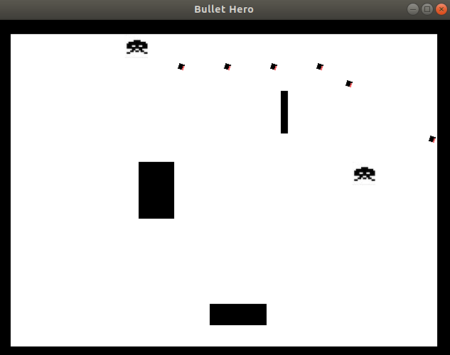

# p2pshoot
A P2P shooting mini-game written in c++ using SDL2pp library.

### Installations 

download / clone with 

    git clone --recursive https://github.com/anthonyho007/bullet-hero.git

to install dependencies on *linux system*

    sudo apt-get install cmake libsd12-dev libsdl2-image-dev libsdl2-ttf-dev

to install dependencies on *macos*

    brew install cmake sdl2 sdl2_image sdl2_ttf

build and start app

    make build

    make start

### Play Instructions

* Key in **UP**, **DOWN**, **LEFT**, **RIGHT** arrow keys to move Up, Down, Left, Right respectively

* Hold down **SPACE** bar to shoot

### Development Status

* Main game engine and skeleton : Done

* enemy AI engine : In progress

* Multiplayer extension : In progress

* Weapon extension : TBD